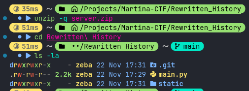
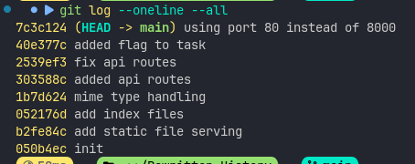
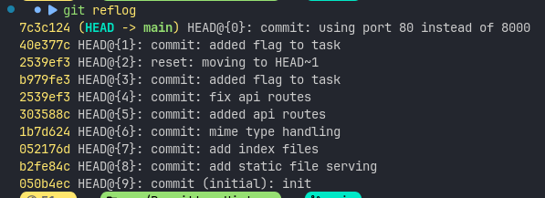
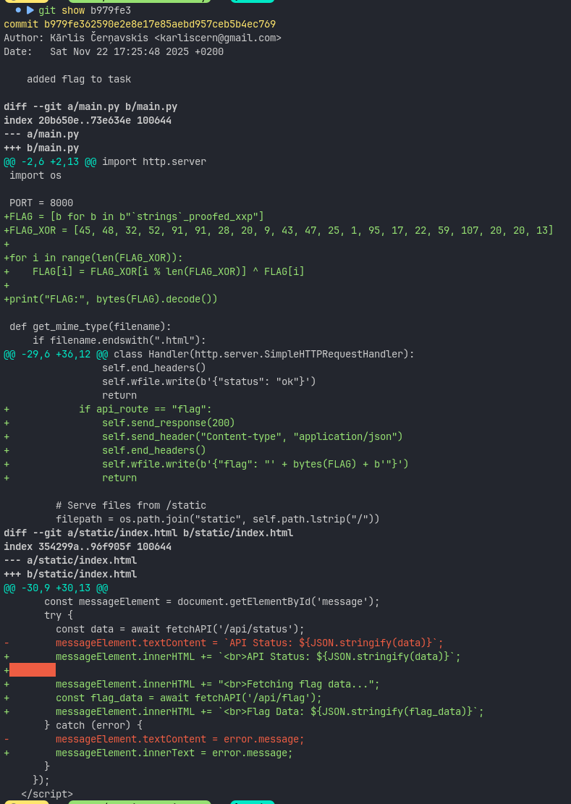
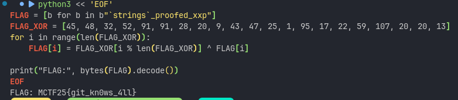

# Mārtiņa-CTF 2025

## Challenge: Rewritten History

## Category: Misc

## Points: 256

## Table of Contents

- [Challenge Description](#challenge-description)
- [Artifacts](#artifacts)
- [Solution Overview](#solution-overview)
- [Solution](#solution)
- [Flag](#flag)

### Challenge Description

You can get the flag for free on this challenge!

Project is licenced under GNU LGPLv3, so source code must be provided :)

### Artifacts

- [server.zip](`server.zip`) - Contains a Python web server and Git repository

### Solution Overview

A simple Python web server with a `/api/flag` endpoint that serves the flag from an environment variable. The twist: the flag was hardcoded in an old Git commit that was later removed through history rewriting. Using `git reflog`, I recovered the original commit containing XOR-encoded flag data, decoded it, and extracted the flag.

### Solution

When I extracted the challenge files, I found a `server.zip` archive. After unzipping it, I saw a directory structure with a Git repository.

#### Initial Exploration

First, I extracted the archive and looked at what we had:



I found:

- A `.git/` directory (this is key!)
- `main.py` - A Python HTTP server
- `static/` - Static web files

**Immediate thought**: The challenge name is "Rewritten History" and there's a Git repo. This has to be about Git history manipulation.

Let me look at the main code:

```python
import http.server
import os

PORT = 80
FLAG = os.environ.get("FLAG")

# ... server code ...

class Handler(http.server.SimpleHTTPRequestHandler):
    def do_GET(self):
        if self.path.startswith("/api/"):
            # ...
            if api_route == "flag":
                if not FLAG:
                    self.send_response(500)
                    self.end_headers()
                    self.wfile.write(b'{"error": "FLAG not set"}')
                    return

                self.send_response(200)
                self.send_header("Content-type", "application/json")
                self.end_headers()
                self.wfile.write(b'{"flag": "' + FLAG.encode() + b'"}')
                return
```

So there's a `/api/flag` endpoint that returns the flag from an environment variable. But we don't have access to that environment variable—we only have the source code.

**Key insight**: The challenge says "you can get the flag for free" and mentions that source code must be provided. Plus the name is "Rewritten History"... this has to mean the flag was in the Git history somewhere but got removed.

#### Checking the Git Log

Let's see what commits are in the repository:



**Interesting!** There's a commit titled "added flag to task" (40e377c). But when I looked at this commit with `git show 40e377c`, it only changed the current code to use `os.environ.get("FLAG")` instead of a hardcoded value. No actual flag there.

**This confirmed my suspicion**: The commit message says "added flag" but the current version doesn't have a hardcoded flag. This means the history was rewritten!

#### The Breakthrough: Git Reflog

In Git, even when you rewrite history (through rebasing, amending, or resetting), the original commits aren't immediately deleted. They remain accessible through the **reflog** (reference log).

I ran:



**BINGO!** Look at entries HEAD@{2} and HEAD@{3}:

- `HEAD@{3}`: `b979fe3` - "added flag to task"
- `HEAD@{2}`: `reset: moving to HEAD~1`
- `HEAD@{1}`: `40e377c` - "added flag to task" (different commit hash!)

This shows exactly what happened:

1. The developer made commit `b979fe3` that added the flag
2. They realized they committed sensitive data (the flag!)
3. They used `git reset HEAD~1` to undo that commit
4. They created a new commit `40e377c` with the same message but without the hardcoded flag

The original commit `b979fe3` is still accessible through the reflog!

#### Extracting the Flag

Now I just needed to look at what was in that original commit:



The commit showed this code:

```python
PORT = 8000
FLAG = [b for b in b"`strings`_proofed_xxp"]
FLAG_XOR = [45, 48, 32, 52, 91, 91, 28, 20, 9, 43, 47, 25, 1, 95, 17, 22, 59, 107, 20, 20, 13]
for i in range(len(FLAG_XOR)):
    FLAG[i] = FLAG_XOR[i % len(FLAG_XOR)] ^ FLAG[i]

print("FLAG:", bytes(FLAG).decode())
```

Perfect! The flag was stored as a byte array and then XOR-encoded. The developer probably thought removing this commit would hide the flag, but the reflog preserved it.

All I had to do was run the decoding logic:



**Flag captured!**

### Flag

**Flag**: `MCTF25{git_kn0ws_4ll}`

### Key Takeaways

This challenge teaches an important security lesson: **Git never truly forgets**. Even when history is rewritten through:

- `git commit --amend`
- `git rebase`
- `git reset`

The original commits remain in the reflog (usually for 30-90 days by default). If you accidentally commit sensitive data like passwords, API keys, or flags:

1. **Don't just rewrite history** - the data is still there in the reflog
2. **Use `git filter-branch` or `BFG Repo-Cleaner`** to properly remove sensitive data
3. **Rotate the compromised secrets** - assume they've been exposed
4. **For public repos, consider the data permanently compromised** once pushed

---

[← Back to Mārtiņa-CTF 2025](../README.md)
