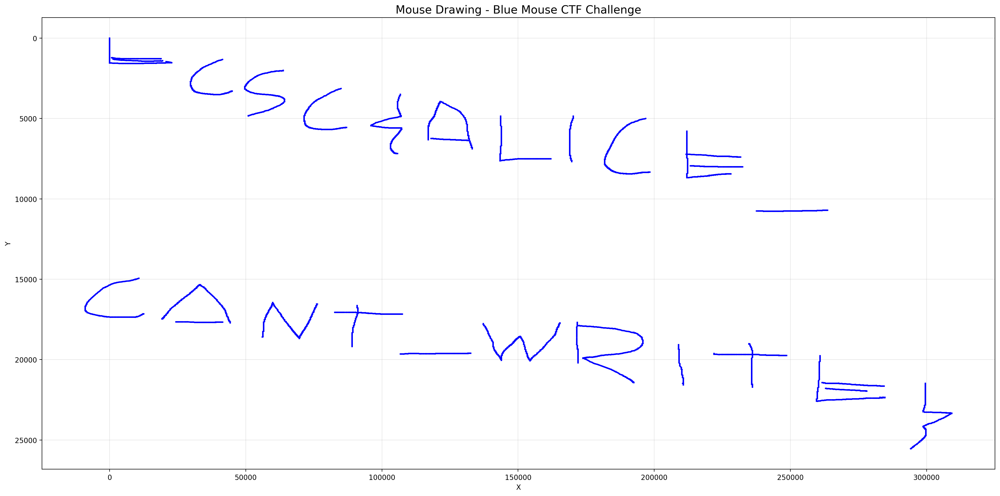

# Blue Mouse

## Challenge Description

Someone drew the flag in a Paint-like program using a Bluetooth mouse, but with poor handwriting. Can you extract and visualize the mouse movements to reconstruct the drawing and read the flag?

## Artifacts

- [`challenge/mouse.pcap`](challenge/mouse.pcap) - Bluetooth HCI packet capture containing mouse movement data
- [`solve/visualize_mouse.py`](solve/visualize_mouse.py) - Python script to extract and visualize the mouse movements

## Solution Overview

This challenge involves analyzing a packet capture (PCAP) file containing Bluetooth Low Energy (BLE) mouse movements. The challenge description states that someone drew the flag in a Paint-like program using a Bluetooth mouse, but with poor handwriting. Our goal is to extract and visualize the mouse movements to reconstruct the drawing and read the flag.

## Tools Used

- **tshark/Wireshark** - For analyzing the packet capture file
- **Python 3** - For parsing mouse data and visualization
- **matplotlib** - For plotting the mouse movements
- **struct** - For parsing binary data

## Solution

### 1. Initial Analysis

First, I examined the provided file to understand what we're working with:

```bash
file mouse.pcap
# Output: pcap capture file, microsecond ts (little-endian) - version 2.4 (Bluetooth HCI H4 with pseudo-header, capture length 262144)
```

This confirmed it's a Bluetooth HCI (Host Controller Interface) capture file, which makes sense for a Bluetooth mouse.

### 2. Inspecting the Packet Capture

Using tshark, I inspected the packets to understand their structure:

```bash
tshark -r mouse.pcap -c 20
```

All packets were **ATT (Attribute Protocol) Handle Value Notifications** on handle 0x0028. This is the standard way Bluetooth LE HID (Human Interface Device) devices like mice send data to the host.

### 3. Extracting Mouse Data

I extracted the actual payload data from all packets:

```bash
tshark -r mouse.pcap -T fields -e btatt.value > /tmp/mouse_data.txt
```

This gave me 6,879 packets of mouse data in hexadecimal format. Each packet follows the standard HID mouse report format:

- **Byte 0**: Button states (bit 0 = left button, bit 1 = right button)
- **Bytes 1-2**: X movement delta (signed 16-bit integer, little-endian)
- **Bytes 3-4**: Y movement delta (signed 16-bit integer, little-endian)
- **Bytes 5-6**: Wheel/scroll data (not relevant for drawing)

### 4. Creating a Visualization Script

The key insight is that when drawing in a Paint-like program, you hold down the left mouse button while moving to draw lines. So I needed to:

1. Parse each mouse movement packet
2. Track cumulative X and Y positions
3. Draw lines between consecutive positions **only when the left button is pressed**

Here's the Python script I created (see [`solve/visualize_mouse.py`](solve/visualize_mouse.py)):

```python
#!/usr/bin/env python3
import struct
import matplotlib.pyplot as plt

# Read the extracted mouse data
with open('/tmp/mouse_data.txt', 'r') as f:
    lines = f.readlines()

# Parse mouse movements and track positions
x, y = 0, 0
positions = []

for line in lines:
    line = line.strip()
    if not line or len(line) < 14:  # Need at least 7 bytes (14 hex chars)
        continue
    
    try:
        data = bytes.fromhex(line)
        
        # Extract button state
        buttons = data[0]
        
        # Extract X and Y deltas as signed 16-bit integers (little-endian)
        # This is crucial because mouse movements can be negative
        x_delta = struct.unpack('<h', data[1:3])[0]
        y_delta = struct.unpack('<h', data[3:5])[0]
        
        # Update cumulative position
        x += x_delta
        y += y_delta
        
        positions.append((x, y, buttons))
        
    except Exception as e:
        print(f"Error parsing line: {line} - {e}")
        continue

print(f"Total positions: {len(positions)}")

# Create visualization with stretched Y axis for better readability
fig, ax = plt.subplots(figsize=(20, 10))

# Draw lines only when left button (bit 0) is pressed
for i in range(len(positions) - 1):
    x1, y1, btn1 = positions[i]
    x2, y2, btn2 = positions[i + 1]
    
    # Check if left button is pressed (bit 0 = 1)
    if btn1 & 0x01:
        ax.plot([x1, x2], [y1, y2], 'b-', linewidth=2)

# Invert Y axis because screen coordinates have Y increasing downward
ax.invert_yaxis()
ax.set_title('Mouse Drawing - Blue Mouse CTF Challenge', fontsize=16)
ax.grid(True, alpha=0.3)

plt.tight_layout()
plt.savefig('mouse_drawing.png', dpi=200, bbox_inches='tight')
print("Drawing saved to mouse_drawing.png")
```

### 5. Key Decisions

- **Signed integers**: Used `struct.unpack('<h', ...)` for signed 16-bit little-endian integers because mouse movements can be in any direction (positive or negative)
- **Cumulative positioning**: Added each delta to running totals to get absolute screen positions
- **Button filtering**: Only drew lines when `buttons & 0x01` was true (left button pressed)
- **Y-axis inversion**: Screen coordinates typically have Y increasing downward, so I inverted the axis
- **Stretched visualization**: Initially the Y-axis was compressed making text unreadable. Removing `ax.set_aspect('equal')` allowed matplotlib to stretch the Y-axis proportionally to the figure size, making the handwritten text legible

### 6. Reading the Flag

After running the script and generating the visualization with proper Y-axis stretching, the mouse drawing clearly showed the handwritten text (albeit with poor handwriting as mentioned in the challenge description):



The flag is: `ECSC{ALICE_CANT_WRITE}`

## Flag

`ECSC{ALICE_CANT_WRITE}`

---

[← Back to ECSC 2025](../../README.md)
