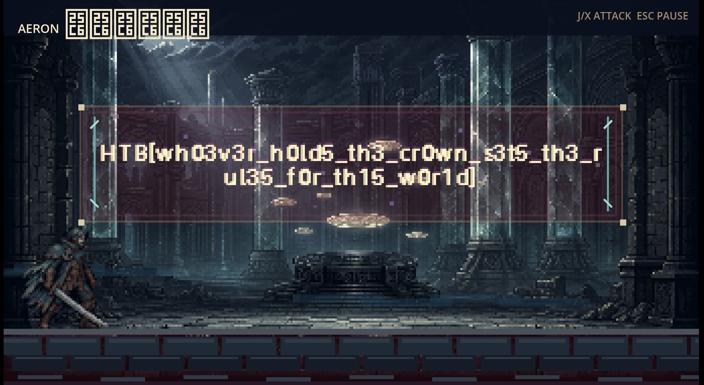
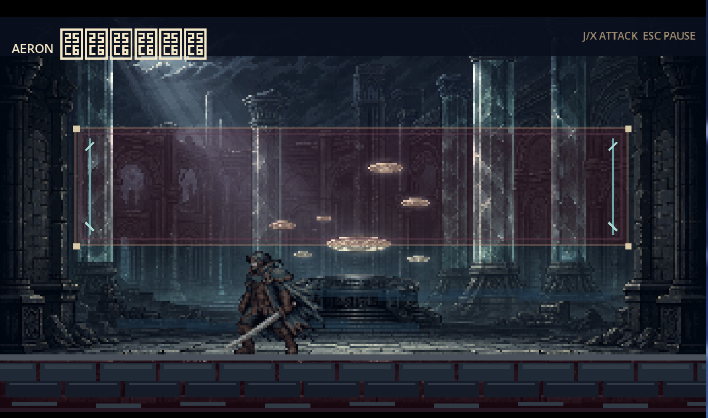

# The Salt Crown

## Solution Overview

`The Salt Crown` is a Windows Godot game whose real progression logic lives in a native GDExtension DLL, not in extractable GDScript. Killing the boss with a classic memory cheat doesn't work: the game keeps a **signed event transcript**, and the final reward image is AES-GCM encrypted under a key derived from the SHA-256 digest of that transcript. Zero the boss's HP and the game answers *"death disputed — the witnessed cannot die"* and rolls the room back.

The solve is to stop fighting the game and start fabricating its history. I launch the game under Wine **as a child of my patcher** (Yama blocks sibling `/proc/pid/mem` writes), rewrite the native `ChallengeCore` state block with a valid seven-event transcript, initialise the reward renderer exactly the way the native initialiser does, NOP a single guard so GDScript still sees the expected scene transition — then press the interact key and let the game draw its own flag.



## Tools Used

- **Wine** to run the Windows export on Linux
- **GDRETools** (which failed — see below) and a disassembler for the native DLL
- **`scanmem` / GameConqueror** for the first, doomed cheating pass
- **Python 3** for the live patcher

## Artifacts

- [`challenge/challenge_core.windows.template_release.x86_64.dll`](challenge/challenge_core.windows.template_release.x86_64.dll) — the native GDExtension holding the real state machine
- [`challenge/live_map_6ffffbd51000_6ffffbdc3000.bin`](challenge/live_map_6ffffbd51000_6ffffbdc3000.bin) — the unpacked runtime mapping every address below is relative to
- [`solve/launch_patchable_game.py`](solve/launch_patchable_game.py) — the final launcher + live patcher
- The 67 MB `The Salt Crown.exe` is not committed; grab it from the challenge files.

## Solution

### Step 1: the Godot route is a dead end

The reflex with any Godot export is *extract the PCK, read the scripts*. GDRETools didn't recover a project tree — the overlay was high-entropy with `SCX1` markers rather than a normal embedded PCK.

Verbose logging still leaked the structure for free:

```bash
WINEDEBUG=-all wine "The Salt Crown.exe" --rendering-driver opengl3 --audio-driver Dummy --verbose
```

```text
res://scripts/app_bootstrap.gdc
res://scripts/levels/stormbound_game.gdc
res://scripts/actors/cassian.gdc
res://scripts/actors/aeron.gdc
res://scripts/world/room_renderer.gdc
```

All scene glue. Meanwhile the native DLL exported a `ChallengeCore` class with `submit_event`, `get_public_state` and — the name that decides the whole challenge — **`render_reward_step`**. The flag isn't a string to find. It's something the game *draws*.

### Step 2: cheat the fight, learn the rules

Before understanding any of that, I did what every GamePwn instinct says: cheat, and use the game as an oracle.

`scanmem` works fine here — snapshot with `?`, then narrow with `<` after taking a hit — and after a few passes I had per-entity health bytes and could delete a regular enemy by writing `0`.

> Note for Arch/Wayland: the packaged GameConqueror launcher goes through `pkexec` and breaks GUI authorization. Running `python3 /usr/share/gameconqueror/GameConqueror.py` directly (after `echo 0 | sudo tee /proc/sys/kernel/yama/ptrace_scope`) sidesteps that, though raw byte edits in its browser were unreliable — plain `scanmem` was better.

Ordinary enemies died. Shielded ones had damage gates. And the boss simply refused:

```text
death disputed
the witnessed cannot die
```

**That failure is the actual hint.** The game doesn't ask "is HP zero?" — it asks "does the recorded history justify this death?" There's a transcript, and the boss checks it. HP cheating bypasses combat; it can't bypass the story.



### Step 3: read the state machine at runtime

The DLL is stripped and packs itself, so static analysis was fighting me. Much easier: let the game unpack, then dump the mapped image and work on that.

```text
live_map_6ffffbd51000_6ffffbdc3000.bin   base = 0x6ffffbd51000
```

The routines that matter:

```text
get_public_state         0x6ffffbd532a0
submit_event wrapper     0x6ffffbd539c0
submit_event logic       0x6ffffbd53b50
event append helper      0x6ffffbd57800
transcript digest helper 0x6ffffbd57870
reward init / status     0x6ffffbd57430 / 0x6ffffbd57420
render_reward_step       0x6ffffbd572b0
reward record processor  0x6ffffbd56ab0
reward draw helper       0x6ffffbd570c0
```

And the layout of the state block they all operate on:

| Offset | Contents |
|--------|----------|
| `+0x00` | story flags (20 dwords) |
| `+0x50` | event records, 8 bytes each |
| `+0xb0` | event count (qword) |
| `+0xb8` | reward renderer state (`0x38` bytes) |

### Step 4: patch from the parent, not from a sibling

First attempt: attach to the running Wine process from a helper script. Denied — `ptrace_scope=1` means a sibling can't write `/proc/<pid>/mem`.

The lazy fix beats disabling a kernel hardening setting: **make the game a child of the patcher**. `subprocess.Popen` the Wine command, and the parent gets write access to its own descendant for free. That one decision is what makes the rest of the exploit a plain file write.

### Step 5: story flags alone aren't enough

The first real patch just wrote a solved-looking set of story flags. It worked — the boss went down, the story advanced — and then the game **hung at the record/assembly scene**.

Three side effects had been skipped:

1. GDScript expects a particular `submit_event` return value to trigger the scene transition.
2. The reward renderer derives its AES key from the **transcript digest**, not from the flags.
3. The renderer has its own status/cursor/step state that nothing had initialised.

A believable ending needs a coherent state, not a plausible-looking front page.

### Step 6: the patch that works

Four writes. Final story flags, the seven-record transcript, a properly initialised renderer, and one instruction patched.

```python
FINAL_STATE_PREFIX = struct.pack(
    "<20I",
    1, 1, 1, 1, 1, 1, 1, 1, 0, 0,
    1, 0, 0x1388, 1, 1, 1, 1, 1, 1, 1,
)

# seven events; note the rolling 1,3,7,f,1f,3f,7f witness bitmask
EVENT_RECORDS = bytes.fromhex(
    "19 01 01 00 01 00 00 00"
    "2d 02 03 00 00 00 00 00"
    "43 03 07 00 00 00 00 00"
    "58 04 0f 00 00 00 00 00"
    "6e 05 1f 00 00 00 00 00"
    "81 06 3f 00 00 00 00 00"
    "b7 07 7f 00 00 00 00 00"
)

TRANSCRIPT_DIGEST = bytes.fromhex(
    "58c1fd695c617b299de3cf4608fcc910e581b0334ff8ddc9726623862c427386"
)
```

The bug that cost me the most time was writing **zeros** into the reward-render state. Reading the native initialiser at `0x6ffffbd57430` shows what it actually stores: the digest in the first 32 bytes, step `0`, cursor `(0x2d, 0x3d)`, cleared flags, and status `1` at offset `0x34`. Reproduce it byte for byte:

```python
REWARD_RENDER_STATE = (
    TRANSCRIPT_DIGEST
    + struct.pack("<QIIHBBI", 0, 0x2D, 0x3D, 0, 0, 0, 1)
)
```

That's `0x38` bytes with `state[0x34:0x38] == 1` — exactly what `render_reward_step` checks before it will draw anything.

Last piece, the script-side handshake. The final `submit_event` guard returns a value GDScript uses to decide the transition; four bytes make it take the winning path:

```python
POST_FINAL_GUARD = bytes.fromhex(
    "83 79 48 00 74 1a 45 33 c0 b8 03 00 00 00"
    "81 fa c4 72 00 00 44 0f 44 c0 41 8b c0 48 83 c4 28 c3"
)
POST_FINAL_GUARD_PATCH = bytes.fromhex("41 89 c0 90")
```

### Step 7: press the interact key

```bash
rm -f patch_now stop_now patchable_game.pid
python3 solve/launch_patchable_game.py
```

Play until the scene is live and the character is controllable, then from a second terminal:

```bash
touch patch_now
```

```text
patched 3 candidate state blocks
0x6ffffb8a3bd1
0x7fc60105574c
0x7fc6013c1380
```

**Timing is the only fragile part.** Patch too early (still in the menu) and the state block doesn't exist yet; patch too late (already stuck in the record/assembly scene) and the transition has been consumed. The window is: playable scene active, final interaction not yet triggered.

Then go back to the Wine window and press interact once. The game calls `render_reward_step`, walks 1024 encrypted draw commands, and paints the flag across the throne room.

## What Failed, and Why It Was Useful

- **GDRETools extraction** — not a recoverable PCK. Told me the logic was native, not scripted.
- **Static reversing the DLL** — stripped and self-unpacking. Dumping the live mapping was strictly faster.
- **Zeroing boss HP** — rejected by covenant validation. This is what revealed the transcript.
- **Sibling-process patching** — blocked by `ptrace_scope=1`. Fixed by spawning the game as a child.
- **Story flags only** — passed gameplay checks, hung the scene. The digest and renderer state also matter.
- **Zeroed reward state** — reached the reward scene with an uninitialised renderer. Nothing drawn.

Every one of them narrowed the target. The boss refusing to die was worth more than a successful cheat would have been.

## Flag

```text
HTB{wh03v3r_h0ld5_th3_cr0wn_s3t5_th3_rul35_f0r_th15_w0r1d}
```

---

[← Back to HTB Cyber Apocalypse 2026](../../README.md)
